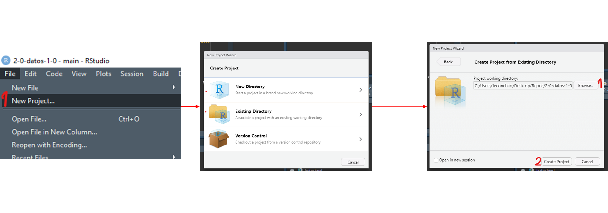

class: center, middle
name: portada

.linea-superior[]
.linea-inferior[]


## INE Educa: Clases abiertas de R

## Proyecto Ciencia de Datos

## Directorio de trabajo y proyectos 


```{r setup, include=FALSE}
options(htmltools.dir.version = TRUE)
knitr::opts_chunk$set(message = FALSE, warning = F, eval = T) 
options(scipen = "999")
options(knitr.table.format = "html")

```

```{r xaringan-themer, include=FALSE, warning=FALSE}
library(xaringanthemer)
library(dplyr)
library(magrittr)
library(readr)

library(kableExtra)
```

---

name: diapo-basica
background-image: url("imagenes/fondo2.PNG")
background-size: contain;
background-position: 100% 0%

# Directorio de trabajo y proyectos
---

template: diapo-basica

## list.files y rutas absolutas

Cuando trabajamos en R, muchas veces lo haremos con archivos de nuestro computador.


--

Si queremos ver los archivos de un directorio particular, podemos usar
`list.files(ruta_directorio)`, donde `ruta_directorio` es un string que representa
el directorio, por ejemplo:

```{r, echo = T}

list.files('C:/Users/Jeconchao/Desktop/Repos/datos-1-1/data')


```
--

Esto es una ruta absoluta, pues parte desde el disco (`C:/`) y tiene dos problemas:

--

1. Hace referencia a carpetas de un usuario particular

--

2. Es largo y engorroso de escribir

---
template:diapo-basica
## list.files y rutas relativas

También podemos usar `list.files()` sin un argumento, lo que mostrará los archivos de la carpeta en que R se encuentra actualmente (directorio de trabajo):

--

```{r, echo = T}
list.files()

```
--

Podemos chequear en qué carpeta nos encontramos con:

```{r, echo = T}
getwd()
```

Lo interesante es que si, por ejemplo, queremos entrar a la carpeta `data`, no es
necesario escribir la ruta completa, sino que basta con partir desde el directorio
de trabajo actual:

```{r, echo = T}
list.files('data/')
```
---
template:diapo-basica
## list.files y rutas relativas

A esto le llamamos ruta relativa, pues no parte desde el disco, sino que desde nuestro
directorio de trabajo actual.

--

Si queremos cambiar nuestro directorio de trabajo podemos utilizar `setwd(ruta)`,
por ejemplo:

--

```{r, echo = T}
setwd('C:/Users/Jeconchao/Documents')
getwd()
list.files('data/')
```

---
template:diapo-basica
## Uso de proyectos

Con lo anterior logramos evitar utilizar rutas absolutas constantemente. 

--

Sin embargo, el uso de `setwd()` nos obliga a usar una ruta absoluta al menos una vez, lo que hace que nuestro código no pueda correr directamente desde cualquier otra carpeta.

--

Para evitar esto, utilizamos los `proyectos` de `RStudio`. 

--

Básicamente crean un archivo que le dice a R que el directorio de trabajo es donde
se aloja el proyecto.

--

Demostraremos en vivo la creación de un proyecto:


---
template:diapo-basica

## Resumen creación de proyectos:

.center[]


---


template: portada