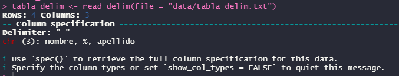
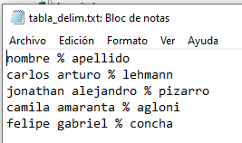

class: center, middle

.linea-superior[]
.linea-inferior[]


## INE Educa: Clases abiertas de R

## Proyecto Ciencia de Datos

### Mayo 2023

```{r setup, include=FALSE}
options(htmltools.dir.version = TRUE)
knitr::opts_chunk$set(message = FALSE, warning = F, eval = T) 
options(scipen = "999")

```

```{r xaringan-themer, include=FALSE, warning=FALSE}
library(xaringanthemer)
library(dplyr)
library(magrittr)

```


---


background-image: url("imagenes/fondo2.PNG")
background-size: contain;
background-position: 100% 0%

# Importación de datos

Queremos traer a R datos que muchas veces provienen de fuentes externas:

--

  - De softwares ofimáticos: Excel, csv.

--

  - De softwares estadísticos: Stata, SPSS, SAS.

--
  - En formatos más específicos: .Rdata, .rds, .feather.
  

  
--

Veremos alternativas para importar cada uno de estos tipos de archivos.


  <p align="center">
  
   
   
  
</p>

---
background-image: url("imagenes/fondo2.PNG")
background-size: contain;
background-position: 100% 0%

# Importación de datos

## readxl

Tablas excel:
--
```{r, warning=FALSE, eval=TRUE}
library(readxl)


tabla_excel <- read_excel(path = "data/paises.xlsx")
```
--
```{r, warning=FALSE, eval=TRUE, echo=FALSE}
knitr::kable(tabla_excel)

```
---
background-image: url("imagenes/fondo2.PNG")
background-size: contain;
background-position: 100% 0%

# Importación de datos

## readr I

Tablas csv:
--
```{r, warning=FALSE, eval=TRUE}
library(readr)


tabla_csv <- read_csv(file = "data/hospital.csv")
```
--
```{r, warning=FALSE, eval=TRUE, echo=FALSE}
knitr::kable(tabla_csv %>% slice_head(n = 5))

```

---
background-image: url("imagenes/fondo2.PNG")
background-size: contain;
background-position: 100% 0%

# Importación de datos

## readr II

Tablas delimitadas por otro caracter:
--
```{r, warning=FALSE, eval=TRUE}


tabla_delim <- read_delim(file = "data/tabla_delim.txt")
```
--
```{r, warning=FALSE, eval=TRUE, echo=FALSE}
knitr::kable(tabla_delim %>% slice_head(n = 5))

```

¿Qué pasó?

--

.center[]


---
background-image: url("imagenes/fondo2.PNG")
background-size: contain;
background-position: 100% 0%

# Importación de datos

## readr II

Tablas delimitadas por otro caracter:

```{r, warning=FALSE, eval=TRUE}


tabla_delim <- read_delim(file = "data/tabla_delim.txt")
```

```{r, warning=FALSE, eval=TRUE, echo=FALSE}
knitr::kable(tabla_delim %>% slice_head(n = 5))

```

¿Qué pasó?


.center[]


---
background-image: url("imagenes/fondo2.PNG")
background-size: contain;
background-position: 100% 0%

# Importación de datos

## readr II

Tablas delimitadas por otro caracter:
```{r, warning=FALSE, eval=TRUE}


tabla_delim <- read_delim(file = "data/tabla_delim.txt", delim = '%') #<<
```
--

```{r, warning=FALSE, eval=TRUE, echo=FALSE}
knitr::kable(tabla_delim %>% slice_head(n = 5))
```
  
---
background-image: url("imagenes/fondo2.PNG")
background-size: contain;
background-position: 100% 0%

# Importación de datos

## Haven

Este paquete permite principalmente la carga de tablas de datos provenientes de otros
softwares estadísticos. En particular:

Stata (archivos .dta):

```{r, eval=FALSE}
library(haven)
esi_dta = read_dta('https://www.ine.gob.cl/docs/default-source/encuesta-suplementaria-de-ingresos/bbdd/stata_esi/2021/esi-2021---personas.dta?sfvrsn=b04b324c_4&download=true')
```


SPSS (archivos .sav):
```{r, eval=FALSE}
esi_sav = read_sav('https://www.ine.gob.cl/docs/default-source/encuesta-suplementaria-de-ingresos/bbdd/spss_esi/2021/esi-2021---personas.sav?sfvrsn=1d2ec611_4&download=true')
```

SAS (archivos .sas7bdat):
```{r, eval=FALSE}
tabla_sas = read_sas('data/airline.sas7bdat')

```
---
background-image: url("imagenes/fondo2.PNG")
background-size: contain;
background-position: 100% 0%

# Importación de datos

## Haven

Este paquete permite principalmente la carga de tablas de datos provenientes de otros
softwares estadísticos. En particular:

Stata (archivos .dta):

```{r, eval=FALSE}
library(haven)
esi_dta = read_dta('https://www.ine.gob.cl/docs/default-source/encuesta-suplementaria-de-ingresos/bbdd/stata_esi/2021/esi-2021---personas.dta?sfvrsn=b04b324c_4&download=true') #<<
```


SPSS (archivos .sav):
```{r, eval=FALSE}
esi_sav = read_sav('https://www.ine.gob.cl/docs/default-source/encuesta-suplementaria-de-ingresos/bbdd/spss_esi/2021/esi-2021---personas.sav?sfvrsn=1d2ec611_4&download=true') #<<
```

SAS (archivos .sas7bdat):
```{r, eval=FALSE}
tabla_sas = read_sas('data/airline.sas7bdat')

```


.right[**Noten que también es posible cargar tablas de datos desde una URL en vez de un archivo en nuestro directorio de trabajo!**]
---
background-image: url("imagenes/fondo2.PNG")
background-size: contain;
background-position: 100% 0%

# Importación de datos

## feather y load()
El paquete feather y el comando load() de R base permiten la carga eficiente de
tablas de datos que se encuentren en los formatos que soportan (.feather el primero y .rds y .Rdata el último). 


feather:
```{r, eval=FALSE}
library(feather)
tabla_feather = read_feather('data/tabla_feather.feather')
```


Objetos de R (.rds):
```{r, eval=FALSE}
copia_tabla_sas = read_rds('data/tabla_sas.rds')

```

Múltiples objetos de R (.Rdata):
```{r, eval=FALSE}
load('data/conjunto_tablas.Rdata')

```


---

background-image: url("imagenes/fondo2.PNG")
background-size: contain;
background-position: 100% 0%

# Importación de datos


---

class: center, middle

.linea-superior[]
.linea-inferior[]


## INE Educa: Clases abiertas de R

## Proyecto Ciencia de Datos

### Mayo 2023
